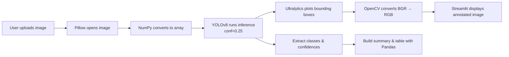

# Detectify Road

[](https://www.python.org/downloads/release/python-3110/)
[](https://streamlit.io/)
[](https://github.com/ultralytics/ultralytics)
[](https://www.gnu.org/licenses/agpl-3.0)
[](https://peps.python.org/pep-0008/)

> **Detectify Road** is an AI-powered web application that automatically identifies and analyzes road objects — such as cars, trucks, buses, motorcycles, and pedestrians — from user-uploaded images, using the **YOLOv8** deep-learning model and an interactive **Streamlit** interface.

---

## Table of Contents

- [Overview](#overview)
- [Features](#features)
- [Demo](#demo)
- [Tech Stack](#tech-stack)
- [Project Structure](#project-structure)
- [Prerequisites](#prerequisites)
- [Installation](#installation)
- [Usage](#usage)
- [How It Works](#how-it-works)
- [Configuration](#configuration)
- [Deployment](#deployment)
- [Testing](#testing)
- [Roadmap](#roadmap)
- [Contributing](#contributing)
- [License](#license)
- [Citation](#citation)
- [Acknowledgments](#acknowledgments)
- [Author](#author)

---

## Overview

Detectify Road demonstrates the practical application of modern computer-vision techniques for **traffic and road-scene analysis**. It leverages the **YOLOv8n** (nano) pre-trained model from Ultralytics to perform real-time object detection on uploaded road images and returns:

- A labelled image showing detected objects with bounding boxes.
- A detection summary with the total number of objects detected.
- A per-class percentage breakdown of every detected category.
- A sortable confidence table for each individual detection.

The project is intended as an educational and research tool for students, developers, and researchers interested in **AI**, **computer vision**, and **intelligent transportation systems**.

---

## Features

- **Real-time object detection** powered by YOLOv8.
- **Intuitive web UI** built with Streamlit — no command-line experience required.
- **Multi-class detection** for common road entities (vehicles, pedestrians, traffic signs, etc.).
- **Confidence scoring** for every detected object.
- **Summary analytics**, including per-class frequency and percentage distribution.
- **Responsive layout** that works on desktop and mobile browsers.
- **Lightweight and fast** — uses the YOLOv8n model (~6 MB).
- **Cross-platform** — runs on Windows, macOS, and Linux.

---

## Demo

> Live demo: _add your Streamlit Cloud URL here once deployed_

```
[Uploaded Image]  →  [YOLOv8 Model]  →  [Annotated Image + Detection Summary]
```

| Step | Description                                                               |
| ---- | ------------------------------------------------------------------------- |
| 1    | User uploads a road image (`.jpg`, `.jpeg`, `.png`).                      |
| 2    | Model performs inference at a confidence threshold of `0.25`.             |
| 3    | Results are rendered with bounding boxes, class labels, and a data table. |

---

## Tech Stack

| Layer            | Technology                                                                      |
| ---------------- | ------------------------------------------------------------------------------- |
| Language         | Python 3.11                                                                     |
| Web framework    | [Streamlit](https://streamlit.io/)                                              |
| ML / CV model    | [Ultralytics YOLOv8](https://github.com/ultralytics/ultralytics) (`yolov8n.pt`) |
| Image processing | OpenCV (headless), Pillow, NumPy                                                |
| Data handling    | Pandas                                                                          |
| Deployment       | Streamlit Community Cloud / Docker / any Linux VPS                              |

---

## Project Structure

```
detectify_road/
├── app.py                # Streamlit entry point — main application logic
├── requirements.txt      # Python dependencies
├── runtime.txt           # Python runtime version (for Streamlit Cloud)
├── yolov8n.pt            # Pre-trained YOLOv8-nano weights
├── LICENSE               # AGPL-3.0 license
├── CITATION.cff          # Citation metadata
├── CONTRIBUTING.md       # Contribution guidelines
├── docker/               # Docker build assets
├── docs/                 # Additional documentation
├── examples/             # Example usage scripts
├── tests/                # Unit and integration tests
└── README.md             # Project documentation (this file)
```

---

## Prerequisites

Before you begin, ensure you have the following installed:

- **Python** `3.11` (strictly recommended for OpenCV/Ultralytics compatibility)
- **pip** `>= 23.0`
- **Git** (for cloning the repository)
- _(Optional)_ A CUDA-capable GPU for faster inference

---

## Installation

### 1. Clone the repository

```bash
git clone https://github.com/<your-username>/detectify_road.git
cd detectify_road
```

### 2. Create a virtual environment (recommended)

```bash
# Linux / macOS
python3.11 -m venv venv
source venv/bin/activate

# Windows (PowerShell)
py -3.11 -m venv venv
.\venv\Scripts\Activate.ps1
```

### 3. Install dependencies

```bash
pip install --upgrade pip
pip install -r requirements.txt
```

### 4. Verify the model weights

The file `yolov8n.pt` should be present at the project root. If missing, it will be automatically downloaded on first run by the Ultralytics library.

---

## Usage

Launch the Streamlit app locally:

```bash
streamlit run app.py
```

Then open your browser at:

```
http://localhost:8501
```

### Workflow

1. Click **"Upload an image"** and choose a `.jpg`, `.jpeg`, or `.png` road photo.
2. Wait a few seconds while YOLOv8 runs inference.
3. Review the annotated image, the **Detection Summary**, per-class percentages, and the confidence table.

---

## How It Works



Key implementation details (see `app.py`):

- `@st.cache_resource` caches the YOLO model to avoid reloading on every interaction.
- Inference uses a confidence threshold of `0.25` (tunable).
- The annotated frame is converted from BGR to RGB before being displayed to correct colour channels.

---

## Configuration

The most common tunable parameters are defined directly in `app.py`:

| Parameter             | Default        | Description                                  |
| --------------------- | -------------- | -------------------------------------------- |
| `model_path`          | `yolov8n.pt`   | YOLOv8 weight file to load.                  |
| `conf`                | `0.25`         | Minimum confidence threshold for detections. |
| `accepted file types` | `jpg/jpeg/png` | Allowed file extensions for uploads.         |

To swap in a larger, more accurate model, replace the weights path in `load_model()`:

```python
return YOLO("yolov8s.pt")  # small
return YOLO("yolov8m.pt")  # medium
return YOLO("yolov8l.pt")  # large
return YOLO("yolov8x.pt")  # x-large
```

---

## Deployment

### Streamlit Community Cloud

1. Push the project to a public GitHub repository.
2. Sign in at [share.streamlit.io](https://share.streamlit.io).
3. Click **"New app"**, select your repo and branch, and set the main file to `app.py`.
4. `runtime.txt` pins Python 3.11 to ensure OpenCV compatibility.
5. Click **Deploy**.

### Docker

```bash
docker build -t detectify-road .
docker run -p 8501:8501 detectify-road
```

### Any Linux VPS

```bash
pip install -r requirements.txt
streamlit run app.py --server.port 8501 --server.address 0.0.0.0
```

---

## Testing

Run the test suite:

```bash
pytest tests/
```

Lint the codebase:

```bash
pip install flake8
flake8 app.py
```

---

## Roadmap

- [ ] Add video-stream support (webcam / uploaded video).
- [ ] Export detection results to CSV / JSON.
- [ ] Add a confidence-threshold slider in the UI.
- [ ] Integrate night-time / low-light image enhancement.
- [ ] Add multilingual UI (English / French / Chinese).
- [ ] Provide a REST API via FastAPI.
- [ ] Dockerize and publish image on Docker Hub.

---

## Contributing

Contributions are welcome and greatly appreciated. Please read [`CONTRIBUTING.md`](CONTRIBUTING.md) before submitting a pull request.

1. Fork the repository.
2. Create a feature branch: `git checkout -b feature/my-feature`.
3. Commit your changes: `git commit -m "feat: add my feature"`.
4. Push to the branch: `git push origin feature/my-feature`.
5. Open a Pull Request.

Please follow the [Conventional Commits](https://www.conventionalcommits.org/) specification and the [PEP 8](https://peps.python.org/pep-0008/) style guide.

---

## License

This project is licensed under the **GNU Affero General Public License v3.0 (AGPL-3.0)**. See the [`LICENSE`](LICENSE) file for full terms.

---

## Citation

If you use Detectify Road in academic work, please cite it as:

```bibtex
@software{detectify_road,
  author  = {Anyanti, Alexander Chibueze},
  title   = {Detectify Road: AI-Powered Road Object Detection with YOLOv8},
  year    = {2026},
  url     = {https://github.com/<your-username>/detectify_road}
}
```

See also [`CITATION.cff`](CITATION.cff).

The underlying model is provided by Ultralytics:

```bibtex
@software{ultralytics_yolov8,
  author  = {Jocher, Glenn and Chaurasia, Ayush and Qiu, Jing},
  title   = {{YOLO} by Ultralytics},
  year    = {2023},
  url     = {https://github.com/ultralytics/ultralytics}
}
```

---

## Acknowledgments

- [Ultralytics](https://github.com/ultralytics/ultralytics) for the YOLOv8 framework.
- [Streamlit](https://streamlit.io/) for the rapid-prototyping web framework.
- [OpenCV](https://opencv.org/) and [Pillow](https://python-pillow.org/) for image I/O and processing.
- The open-source community for the training datasets and pre-trained weights.

---

## Author

**NWakonobi Chisom Malvis**
Project submitted as part of the Higher National Diploma (HND) programme.

- GitHub: [@malvisanochie1](https://github.com/)
- Email: *malvisanochie97@gmail.com*

---

<p align="center">
  <sub>Built with Python, YOLOv8, and Streamlit · © 2026 Nwakonobi Chisom Malvis</sub>
</p>
